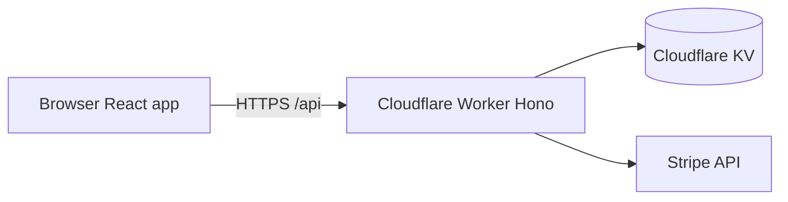

# Architecture map (agents)

Short entry point for codebase navigation. **Full detail:** [docs/ARCHITECTURE.md](./docs/ARCHITECTURE.md).

## System context



## Code layers

Dependencies flow **downward** only (enforced by `scripts/harness/validate-architecture.mjs`).

```
┌─────────────────────────────────────────────────────────┐
│  UI: src/pages/, src/components/, src/contexts/       │
│       may use: src/api/, src/lib/                     │
├─────────────────────────────────────────────────────────┤
│  Client API: src/api/                                   │
├─────────────────────────────────────────────────────────┤
│  HTTP: src/routes/, src/middleware/, src/worker.js      │
│       may use: services, lib, utils, config             │
├─────────────────────────────────────────────────────────┤
│  Domain: src/services/                                  │
│       may use: lib, utils, config                       │
├─────────────────────────────────────────────────────────┤
│  Foundation: src/lib/, src/utils/, src/config/          │
│       must not import services, routes, or UI           │
└─────────────────────────────────────────────────────────┘
```

## Domain modules

| Domain | Service(s) | Routes |
|--------|------------|--------|
| Products | `ProductService`, `ProductStripeService` | `routes/public/products.js`, `routes/admin/products.js` |
| Collections | `CollectionService` | `routes/public/collections.js`, `routes/admin/collections.js` |
| Store settings | `StoreSettingsService`, `ThemeService` | `routes/public/storeSettings.js`, `routes/admin/settings.js` |
| Checkout | `StripeService` | `routes/public/checkout.js` |
| Analytics | `AnalyticsService` | `routes/admin/analytics.js` |
| Media | `MediaService`, `R2Service` | `routes/admin/media.js`, `routes/public/images.js` |

## Data store

OpenShop uses **Cloudflare KV**, not a relational database. Key layout and entity shapes: [docs/generated/kv-data-model.md](./docs/generated/kv-data-model.md).

## Security boundary

- **Worker `env`:** secrets, KV bindings, Stripe keys.
- **Browser:** publishable Stripe key only; admin token in `localStorage` after login.

See [docs/SECURITY.md](./docs/SECURITY.md).

## Related docs

- [docs/DESIGN.md](./docs/DESIGN.md) — patterns and anti-patterns
- [docs/FRONTEND.md](./docs/FRONTEND.md) — React structure
- [docs/RELIABILITY.md](./docs/RELIABILITY.md) — failure modes
- [AGENTS.md](./AGENTS.md) — full agent map
