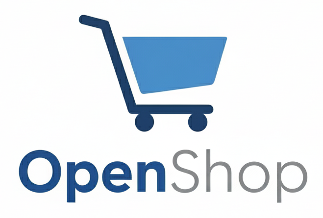

<div align="center">
  
  
  # OpenShop - An Open-Source AI Platform for Smarter Stores.

  > Launch your online store in minutes. Built on Cloudflare's edge network for lightning-fast performance, zero infrastructure costs, and unlimited scalability.
</div>

[](https://www.gnu.org/licenses/agpl-3.0)
[](https://nodejs.org)

---

## Why OpenShop?

OpenShop is the fastest, most cost-effective way to launch an e-commerce store. Built entirely on Cloudflare's edge network, you get:

- **⚡ Lightning Fast** - Sub-100ms response times worldwide
- **💰 Completely Free** - Stays within Cloudflare's generous free tier (100k requests/day)
- **🚀 One-Command Deploy** - Your store is live in under 5 minutes
- **🔒 Enterprise Security** - Built-in DDoS protection, SSL, and secure authentication
- **📱 Mobile-First** - Beautiful, responsive design that works everywhere
- **🔄 Unlimited Stores** - Deploy as many stores as you want from one codebase

Perfect for entrepreneurs, developers, and businesses who want a professional online store without the complexity or cost of traditional e-commerce platforms.

---

## 🌟 Features

### Core Functionality
- **🛒 Complete E-commerce** - Products, collections, shopping cart, and Stripe checkout
- **📦 Product Management** - Multiple images, variants, and rich descriptions
- **📁 Collections** - Organize products with beautiful hero banners
- **💳 Stripe Integration** - Automatic product sync and secure payment processing
- **📊 Analytics Dashboard** - Real-time revenue and order insights

### User Experience
- **🛍️ Smart Shopping Cart** - Persistent cart with quantity management
- **📱 Mobile Optimized** - Fully responsive with mobile-specific cart experience
- **🧭 Intuitive Navigation** - Collection links with product preview dropdowns
- **🎨 Beautiful UI** - Modern design with Tailwind CSS and ShadCN/UI

### Advanced Features
- **🖼️ Rich Media Support** - Multiple product images with carousel navigation
- **🎨 Store Customization** - Dynamic logo management (text or image)
- **🔒 Secure Admin System** - Token-based authentication with session management
- **🧠 AI Image Generation** (Optional) - Generate product images with Gemini AI
- **☁️ Google Drive Integration** (Optional) - Store and serve images from Google Drive

---

## 🚀 Quick Start

### Prerequisites

- **Node.js 18+** - [Download here](https://nodejs.org)
- **Cloudflare Account** - [Sign up free](https://dash.cloudflare.com/sign-up)
- **Stripe Account** - [Create account](https://stripe.com)

### One-Command Setup

1. **Clone and Install**
   ```bash
   git clone https://github.com/AJFrio/OpenShop openshop
   cd openshop
   npm install
   ```

2. **Automated Deployment**
   ```bash
   npm run setup
   ```
   
   The setup wizard will prompt you for:
   - **Project Name** - Unique name for your store
   - **Cloudflare API Token** - [Get token here](https://dash.cloudflare.com/?to=/:account/api-tokens)
   - **Cloudflare Account ID** - Found in your Cloudflare dashboard
   - **Stripe Keys** - Secret and publishable keys from Stripe dashboard
   - **Admin Password** - Your secure admin password
   - *(Optional)* **Gemini API Key** - For AI image generation
   - *(Optional)* **Google OAuth** - For Google Drive integration

   See [Configuration Guide](docs/CONFIGURATION.md) for detailed setup instructions.

3. **🎉 Your Store is Live!**
   
   Access your store at: `https://your-project-name.username.workers.dev`
   
   Access admin at: `https://your-project-name.username.workers.dev/admin`

---

## 🔒 Admin Dashboard

Access your admin dashboard at `/admin` on your store URL.

**Security Features:**
- Password-protected login
- 24-hour session tokens
- Separate authenticated API endpoints
- No visible admin link on storefront (access via direct URL)

**Admin Capabilities:**
- Create, edit, and delete products with multiple images
- Manage collections with hero banners
- Customize store branding and appearance
- View real-time analytics and revenue insights
- Generate AI images (optional)
- Upload images to Google Drive (optional)

For detailed admin documentation, see [Architecture Guide](docs/ARCHITECTURE.md).

---

## 🏪 Multiple Store Support

Deploy unlimited stores from a single codebase, each with its own:
- Worker deployment and subdomain
- Isolated KV namespace (separate data)
- Admin credentials and settings
- Stripe configuration

```bash
# Create your first store
npm run setup
# Project Name: "electronics-hub"

# Create another store
npm run setup
# Project Name: "fashion-boutique"

# List all your stores
npm run sites

# Deploy a specific store
npm run deploy electronics-hub
```

See [Deployment Guide](docs/DEPLOYMENT.md) for complete multi-site documentation.

---

## 🛠️ Development

### Local Development

```bash
# Full-stack development (Worker + Frontend)
npm run dev

# Frontend-only development
npm run dev:frontend

# Build for production
npm run build

# Deploy to production
npm run deploy

# Preview production build locally
npm run preview
```

For detailed development instructions, see [Development Guide](DEVELOPMENT.md).

---

## 📚 Documentation

Complete documentation is available in the `docs/` directory:

- **[Architecture Guide](docs/ARCHITECTURE.md)** - Technical architecture, security, and data models
- **[API Reference](docs/API.md)** - Complete API documentation
- **[Configuration Guide](docs/CONFIGURATION.md)** - Environment variables and setup
- **[Stripe Integration](docs/STRIPE.md)** - Payment processing and webhook setup
- **[AI & Media](docs/AI_MEDIA.md)** - Gemini AI and Google Drive integration
- **[Deployment Guide](docs/DEPLOYMENT.md)** - Deployment instructions and multi-site setup
- **[Performance Guide](docs/PERFORMANCE.md)** - Performance metrics and optimization
- **[Customization Guide](docs/CUSTOMIZATION.md)** - Frontend and backend customization
- **[Troubleshooting](docs/TROUBLESHOOTING.md)** - Common issues and solutions
- **[Testing Guide](docs/TESTING.md)** - Testing guidelines and examples

---

## 🤝 Contributing

We welcome contributions! Please follow these steps:

1. **Fork** the repository
2. **Create** a feature branch (`git checkout -b feature/amazing-feature`)
3. **Commit** your changes (`git commit -m 'Add amazing feature'`)
4. **Push** to the branch (`git push origin feature/amazing-feature`)
5. **Open** a Pull Request

### Development Guidelines

- Follow existing code style and patterns
- Add tests for new functionality
- Update documentation for any changes
- Ensure all builds pass before submitting

---

## 📄 License

This project is licensed under the **GNU Affero General Public License v3.0 (AGPL-3.0)** - see the [LICENSE](LICENSE) file for details.

---

## 🆘 Support & Community

### Getting Help

- **📚 Documentation** - Complete guides in the `docs/` directory
- **🐛 Bug Reports** - [GitHub Issues](https://github.com/ajfrio/openshop/issues)
- **💡 Feature Requests** - [GitHub Discussions](https://github.com/ajfrio/openshop/discussions)
- **💬 Community Chat** - [Discord Server](https://discord.gg/qAnDxHmEmS)

### Resources

- [Cloudflare Workers Documentation](https://developers.cloudflare.com/workers/)
- [Stripe API Documentation](https://stripe.com/docs/api)
- [Tailwind CSS Documentation](https://tailwindcss.com/docs)
- [ShadCN/UI Documentation](https://ui.shadcn.com/)

---

## 🙏 Acknowledgments

Special thanks to:

- **Cloudflare** - For the incredible Workers platform and generous free tier
- **Stripe** - For reliable payment processing and excellent developer experience  
- **Vercel** - For the ShadCN/UI component library
- **The Open Source Community** - For the amazing tools and libraries

---

## 🌟 Showcase

> **Built something awesome with OpenShop?** We'd love to feature your store! Open an issue with your store URL and a brief description.

---

<div align="center">

**Made with ❤️ for the open-source community**

[⭐ Star this repo](https://github.com/ajfrio/openshop) • [🐛 Report Bug](https://github.com/ajfrio/openshop/issues) • [💡 Request Feature](https://github.com/ajfrio/openshop/discussions)

</div>
