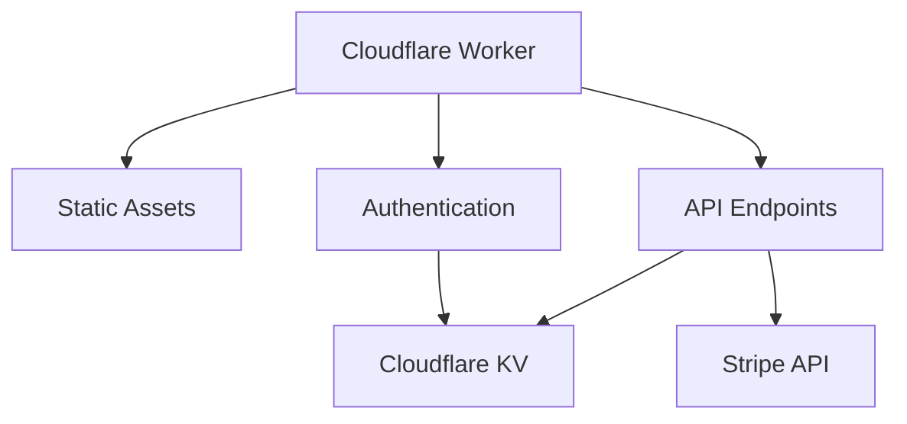
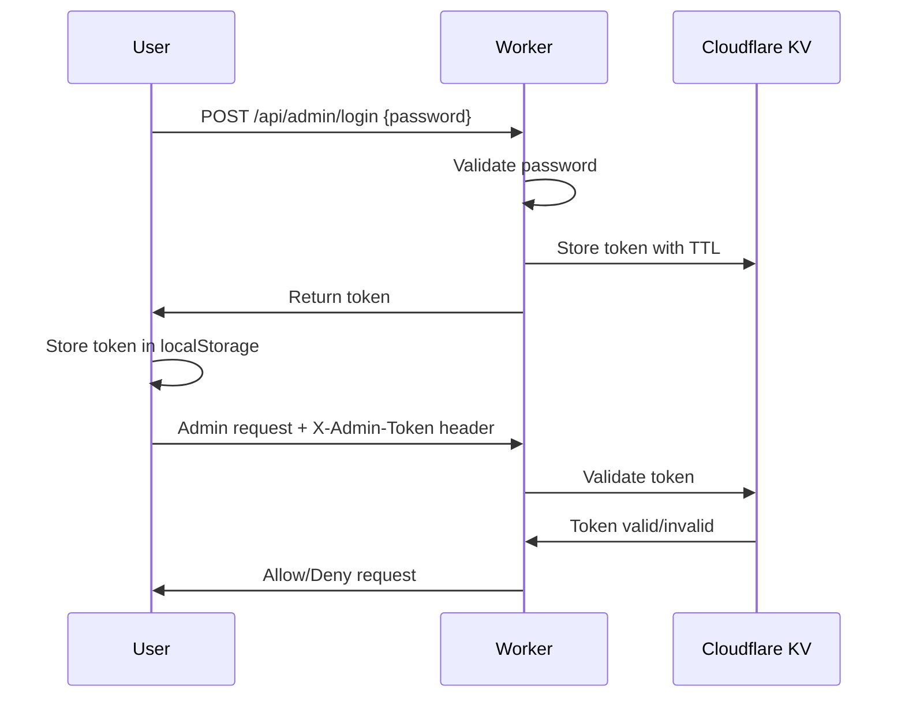

<div align="center">
  
  
  # OpenShop - Free Cloudflare Based E-commerce Platform

## Admin AI Image Generation (Gemini + Google Drive)

This project includes an admin-only AI image generator powered by Google's Gemini API, with optional one-click upload of generated images to Google Drive. It also includes a smart image proxy and URL normalization for reliable Drive-hosted images on the storefront and admin.

Environment variables (set via `wrangler secret put` in production):

- `GEMINI_API_KEY` — Google AI Studio API key for Gemini.
- `GOOGLE_CLIENT_ID` — OAuth 2.0 Client ID from Google Cloud Console.
- `GOOGLE_CLIENT_SECRET` — OAuth 2.0 Client Secret.
- `DRIVE_ROOT_FOLDER` (optional) — Folder name at Drive root for uploads. Default: `OpenShop`.
- `SITE_URL` — Your deployed Worker URL (informational; setup script also writes it).

Google Cloud setup:

- Create an OAuth 2.0 Client (type: Web application) in Google Cloud Console.
- Add Authorized redirect URI: `https://<your-worker-domain>/api/admin/drive/oauth/callback`
- Enable the Google Drive API in your project.

Server endpoints:

- `POST /api/admin/ai/generate-image` (admin) — Calls Gemini REST with body `{ prompt, inputs: [{ mimeType, dataBase64 }] }`. Returns `{ mimeType, dataBase64 }` of the generated image.
- `GET /api/admin/drive/oauth/start` (no auth) — Starts Google Drive OAuth (scope `https://www.googleapis.com/auth/drive.file`, offline access).
- `GET /api/admin/drive/oauth/callback` (no auth) — Handles OAuth callback, exchanges code for tokens, stores in KV, and closes the popup.
- `GET /api/admin/drive/status` (admin) — Returns `{ connected: boolean }` to indicate Drive linkage.
- `POST /api/admin/drive/upload` (admin) — Uploads `{ mimeType, dataBase64, filename }` to Drive, ensures a root folder (by `DRIVE_ROOT_FOLDER`), sets file permission to `anyone:reader`, returns:
  ```json
  {
    "id": "<fileId>",
    "viewUrl": "https://drive.usercontent.google.com/download?id=<fileId>&export=view",
    "webViewLink": "https://drive.google.com/file/d/<fileId>/view",
    "downloadUrl": "https://drive.usercontent.google.com/download?id=<fileId>&export=view",
    "folder": { "id": "...", "name": "..." }
  }
  ```
- `GET /api/image-proxy?src=<url>` (public) — Proxies Google Drive-hosted images to avoid 403/CORS, normalizing to the `drive.usercontent.google.com` CDN when possible.

Implementation details:

- Gemini model used: `gemini-2.5-flash-image-preview` via `https://generativelanguage.googleapis.com/v1beta/...:generateContent` with header `x-goog-api-key`.
- Drive OAuth tokens are stored in KV under `drive:oauth:tokens` and silently refreshed using `refresh_token` when available.
- The desired upload folder is created at Drive root if missing. Name is from `DRIVE_ROOT_FOLDER` or defaults to `OpenShop`.
- Frontend normalizes and proxies Drive links for reliable previews via `normalizeImageUrl` and the `/api/image-proxy` endpoint.

Admin UI usage:

- In admin image fields (`ImageUrlField`), click "Generate" to open the Gemini modal.
- Enter a prompt and optionally add up to 4 reference images.
- Click Generate to create an image. Preview appears in the modal.
- Choose "Use data URL" or connect Drive and then "Upload to Drive" to insert a shareable URL.

Key frontend components/utilities:

- `src/components/admin/AiImageModal.jsx` — Gemini generation, Drive connect/upload.
- `src/components/admin/ImageUrlField.jsx` — Image URL input with Generate button and Drive URL normalization.
- `src/lib/utils.js` → `normalizeImageUrl(url)` — Proxies known Drive URLs through `/api/image-proxy` and normalizes to direct-view links.

Example requests:

- Generate with Gemini
  ```bash
  curl -X POST "https://<your-worker>/api/admin/ai/generate-image" \
    -H "Content-Type: application/json" \
    -H "X-Admin-Token: <token>" \
    -d '{
      "prompt": "A minimal product photo on white background",
      "inputs": []
    }'
  ```

- Upload generated image to Drive
  ```bash
  curl -X POST "https://<your-worker>/api/admin/drive/upload" \
    -H "Content-Type: application/json" \
    -H "X-Admin-Token: <token>" \
    -d '{
      "mimeType": "image/png",
      "dataBase64": "<base64>",
      "filename": "openshop-image.png"
    }'
  ```

Troubleshooting:

- Invalid redirect URI during OAuth — Ensure the exact callback URL is in Google Cloud Console.
- 403/CORS loading Drive images — Use the returned `viewUrl` or rely on `normalizeImageUrl` which routes through `/api/image-proxy`.

References:

- Gemini image editing: https://ai.google.dev/gemini-api/docs/image-generation#gemini-image-editing
- Google Drive API: https://developers.google.com/drive/api

  > A lightweight, open-source e-commerce platform built entirely on the Cloudflare ecosystem. Leverages Cloudflare Workers for hosting, Cloudflare KV for data storage, and Stripe for payments - designed to stay within Cloudflare's generous free tier.
</div>

[](https://opensource.org/licenses/MIT)
[](https://nodejs.org)

---

## 🌟 Features

### Core Functionality
- **⚡ Lightning Fast** - Built on Cloudflare's global edge network
- **💰 Cost Effective** - Designed for Cloudflare's generous free tier (100k requests/day)
- **🛒 Complete E-commerce** - Product management, collections, and Stripe checkout
- **🔧 One-Command Setup** - Automated deployment and configuration

### User Experience
- **🛍️ Smart Shopping Cart** - Persistent cart with quantity management
- **📱 Mobile Optimized** - Fully responsive with mobile-specific cart experience
- **🧭 Intuitive Navigation** - Collection links with product preview dropdowns
- **🎨 Beautiful UI** - Modern design with Tailwind CSS and ShadCN/UI

### Advanced Features
- **🖼️ Rich Media Support** - Multiple product images with carousel navigation
- **🎨 Store Customization** - Dynamic logo management (text or image)
- **📊 Analytics Dashboard** - Real-time Stripe analytics with revenue insights
- **🔒 Secure Admin System** - Token-based authentication with session management

---

## 🏗️ Technical Architecture



| Component | Technology | Purpose |
|-----------|------------|---------|
| **Frontend** | Vite + React + Tailwind CSS | User interface and experience |
| **Backend** | Cloudflare Workers + Hono | API endpoints and business logic |
| **Database** | Cloudflare KV | Product, collection, and settings storage |
| **Payments** | Stripe API | Payment processing and checkout |
| **Authentication** | Token-based system | Secure admin access |
| **Deployment** | Wrangler CLI | Automated deployment pipeline |

---

## 🚀 Quick Start

### Prerequisites

- **Node.js 18+** - [Download here](https://nodejs.org)
- **Cloudflare Account** - [Sign up free](https://dash.cloudflare.com/sign-up)
- **Stripe Account** - [Create account](https://stripe.com)

### One-Command Setup

1. **Clone and Install**
   ```bash
   git clone https://github.com/AJFrio/OpenShop openshop
   cd openshop
   npm install
   ```

2. **Automated Deployment**
   ```bash
   npm run setup
   ```
   
   **Setup prompts:**
   - **Project Name** - Unique name for your store (e.g., "my-electronics-store")
   - **Cloudflare API Token** - [Get token here](https://dash.cloudflare.com/?to=/:account/api-tokens)
     <details>
       <summary><strong>Required token permissions</strong></summary>

       - **Account — API settings**
         - Containers: Edit
         - Secrets Store: Edit
         - Workers Pipelines: Edit
         - Workers AI: Edit
         - Queues: Edit
         - Vectorize: Edit
         - Hyperdrive: Edit
         - Cloudchamber: Edit
         - D1: Edit
         - Workers R2 Storage: Edit
         - Workers KV Storage: Edit
         - Workers Scripts: Edit
         - Account Settings: Read
       - **All zones**
         - Workers Routes: Edit
       - **All users**
         - Memberships: Read
         - User Details: Read
     </details>
   - **Cloudflare Account ID** - Found in your Cloudflare dashboard
   - **Stripe Secret Key** - From your Stripe dashboard
   - **Stripe Publishable Key** - From your Stripe dashboard
   - **Admin Password** - Custom password (default: admin123)

3. **🎉 Your Store is Live!**
   
   Access your store at: `https://your-project-name.username.workers.dev`

---

## 🔒 Admin Dashboard

### Access & Security

**URL**: `https://your-project-name.username.workers.dev/admin`

> **Note**: For security, there's no visible admin button on the storefront. Access the admin dashboard directly via URL.

### Security Features

| Feature | Description |
|---------|-------------|
| **🔐 Password Protection** | Admin login required with configurable password |
| **🎫 Token-Based Auth** | Secure 24-hour session tokens stored in KV |
| **🛡️ API Separation** | Separate authenticated endpoints for admin operations |
| **⏰ Auto Logout** | Expired sessions automatically redirect to login |

### Admin Capabilities

- **📦 Product Management** - Create, edit, delete products with multiple images
- **📁 Collection Management** - Organize products with hero banner images
- **🎨 Store Customization** - Dynamic logo and branding management
- **📊 Analytics Dashboard** - Real-time revenue and order insights
- **⚙️ Settings Management** - Configure store appearance and behavior

---

## 🏪 Multiple Store Support

Deploy unlimited stores with unique configurations:

```bash
# Electronics Store
npm run setup
# Project Name: "electronics-hub"
# Result: https://electronics-hub.workers.dev

# Fashion Store
npm run setup  
# Project Name: "fashion-boutique"
# Result: https://fashion-boutique.workers.dev

# Book Store
npm run setup
# Project Name: "online-bookstore" 
# Result: https://online-bookstore.workers.dev
```

### Resource Isolation

Each store gets completely isolated resources:

| Resource | Naming Convention | Example |
|----------|-------------------|---------|
| **Worker** | `project-name.username.workers.dev` | `electronics-hub.username.workers.dev` |
| **KV Namespace** | `PROJECT-NAME_KV` | `ELECTRONICS-HUB_KV` |
| **Admin Access** | `/admin` on each domain | `electronics-hub.workers.dev/admin` |

---

## 🛠️ Development

### Local Development Commands

```bash
# Full-stack development (Worker + Frontend)
npm run dev

# Frontend-only development (Vite dev server)
npm run dev:frontend

# Build for production
npm run build

# Deploy to production
npm run deploy

# Preview production build locally
npm run preview
```

### Development Workflow

1. **Local Development** - Use `npm run dev` for full-stack development with hot reload
2. **Frontend Changes** - Use `npm run dev:frontend` for faster frontend-only development
3. **Testing** - Build and test locally before deployment
4. **Deployment** - Use `npm run deploy` to push changes to production

---

## 📊 Data Models

### Product Schema
```json
{
  "id": "prod_1a2b3c4d5e",
  "name": "Classic Cotton T-Shirt",
  "description": "A comfortable, high-quality t-shirt made from premium cotton.",
  "price": 25.00,
  "currency": "usd",
  "images": [
    "https://example.com/image1.jpg",
    "https://example.com/image2.jpg",
    "https://example.com/image3.jpg"
  ],
  "stripePriceId": "price_AbC987zyx",
  "stripeProductId": "prod_AbC123xyz",
  "collectionId": "coll_xyz789"
}
```

### Collection Schema
```json
{
  "id": "coll_xyz789",
  "name": "Summer Collection",
  "description": "Our hottest items for the summer season.",
  "heroImage": "https://example.com/hero-banner.jpg"
}
```

### Store Settings Schema
```json
{
  "logoType": "text|image",
  "logoText": "OpenShop",
  "logoImageUrl": "https://example.com/logo.png",
  "storeName": "OpenShop",
  "storeDescription": "Your amazing online store"
}
```

---

## 📝 API Reference

### Public Endpoints (Read-Only)

| Endpoint | Method | Description | Authentication |
|----------|--------|-------------|----------------|
| `/api/products` | `GET` | List all products | None |
| `/api/products/:id` | `GET` | Get single product | None |
| `/api/collections` | `GET` | List all collections | None |
| `/api/collections/:id` | `GET` | Get single collection | None |
| `/api/collections/:id/products` | `GET` | Get products in collection | None |
| `/api/store-settings` | `GET` | Get store configuration | None |

### Checkout Endpoints

| Endpoint | Method | Description | Authentication |
|----------|--------|-------------|----------------|
| `/api/create-checkout-session` | `POST` | Single item checkout | None |
| `/api/create-cart-checkout-session` | `POST` | Multi-item cart checkout | None |
| `/api/image-proxy?src=<url>` | `GET` | Proxy for Google Drive images | None |

### Admin Endpoints (Authenticated)

| Endpoint | Method | Description | Authentication |
|----------|--------|-------------|----------------|
| `/api/admin/login` | `POST` | Admin authentication | Password |
| `/api/admin/products` | `POST` | Create product | Admin Token |
| `/api/admin/products/:id` | `PUT, DELETE` | Update/delete product | Admin Token |
| `/api/admin/store-settings` | `PUT` | Update store settings | Admin Token |
| `/api/analytics` | `GET` | Revenue and order analytics | Admin Token |
| `/api/admin/ai/generate-image` | `POST` | Generate image via Gemini | Admin Token |
| `/api/admin/drive/status` | `GET` | Google Drive connection status | Admin Token |
| `/api/admin/drive/oauth/start` | `GET` | Begin Google Drive OAuth | None |
| `/api/admin/drive/oauth/callback` | `GET` | Handle Drive OAuth callback | None |
| `/api/admin/drive/upload` | `POST` | Upload image to Google Drive | Admin Token |

---

## 🔧 Configuration

### Environment Variables

Create a `.env` file for local development:

```env
# Cloudflare Configuration
CLOUDFLARE_API_TOKEN=your_cloudflare_api_token
CLOUDFLARE_ACCOUNT_ID=your_cloudflare_account_id

# Stripe Configuration  
STRIPE_SECRET_KEY=sk_test_your_stripe_secret_key
VITE_STRIPE_PUBLISHABLE_KEY=pk_test_your_stripe_publishable_key

# Admin Configuration
ADMIN_PASSWORD=your_secure_admin_password

# Site Configuration
SITE_URL=https://your-project.workers.dev
```

### Cloudflare Setup

The setup script automatically configures:

- ✅ **KV Namespace** - Creates isolated data storage
- ✅ **Worker Deployment** - Deploys your application
- ✅ **Environment Variables** - Sets all required secrets
- ✅ **Static Assets** - Configures asset serving
- ✅ **Custom Domain** - Sets up your unique subdomain

---

## 💳 Stripe Integration

### Automatic Synchronization

- **Product Creation** - Automatically creates Stripe products and prices
- **Price Management** - Updates handled seamlessly
- **Checkout Sessions** - Secure payment processing
- **Multiple Items** - Cart checkout with line items

### Webhook Setup (Optional)

For advanced order tracking:

1. **Stripe Dashboard** → Webhooks
2. **Add Endpoint**: `https://your-project.workers.dev/api/stripe-webhook`
3. **Select Events**: `checkout.session.completed`, `payment_intent.succeeded`

---

## 🚀 Deployment

### Automated Deployment

```bash
# Deploy updates
npm run deploy
```

### Manual Deployment

```bash
# Build the project
npm run build

# Deploy to Cloudflare Workers
wrangler deploy
```

### Deployment Process

1. **Build Frontend** - Vite builds React app to `dist/`
2. **Deploy Worker** - Wrangler deploys Worker with static assets
3. **Update Configuration** - Environment variables and bindings applied
4. **Global Distribution** - Deployed to Cloudflare's edge network

---

## 🔒 Security Architecture

### Authentication Flow



### Data Protection

| Layer | Protection Method |
|-------|------------------|
| **Transport** | HTTPS encryption (Cloudflare SSL) |
| **Storage** | KV encryption at rest and in transit |
| **Authentication** | Token-based with server-side validation |
| **Authorization** | Endpoint-level access control |
| **Input Validation** | Server-side sanitization and validation |

---

## 📈 Performance Metrics

### Cloudflare Workers Benefits

- **🚀 Global Edge** - Sub-100ms response times worldwide
- **⚡ Zero Cold Starts** - Instant function execution
- **📊 100k Requests/Day** - Generous free tier limits
- **🔄 Auto-scaling** - Handles traffic spikes automatically
- **💾 KV Storage** - 100k reads, 1k writes daily (free tier)

### Optimization Features

- **Static Asset Caching** - CDN caching for images, CSS, JS
- **API Response Caching** - Smart caching for product/collection data
- **Image Optimization** - Cloudflare image resizing and optimization
- **Minification** - Automatic JS/CSS minification

---

## 🎨 Customization

### Frontend Customization

```bash
# Tailwind CSS configuration
tailwind.config.js

# Component customization
src/components/ui/

# Theme customization  
src/index.css
```

### Backend Customization

```bash
# API routes
src/worker.js

# Middleware
src/middleware/

# Business logic
src/lib/
```

---

## 🔧 Troubleshooting

### Common Setup Issues

**Issue: KV Namespace Creation Error**
```bash
# Error: Unknown arguments: preview, kv:namespace, create
```
**Solution**: Using correct Wrangler command syntax (fixed in latest version)

**Issue: Authentication Error**
```bash
# Error: You are logged in with an API Token
```
**Solution**: Script now uses API Token directly without OAuth login

**Issue: Empty KV ID in wrangler.toml**
```bash
# Error: "id" field but got {"binding":"OPENSHOP_KV","id":""}
```
**Solution**: KV binding added after namespace creation (fixed)

**Issue: 500 Error on /admin Route**
```bash
# Error: 500 Internal Server Error when visiting /admin
```
**Solution**: Fixed SPA routing to properly serve React app for client-side routes (fixed)

**Issue: 404 Error When Creating Collections/Products**
```bash
# Error: POST /api/collections 404 (Not Found)
```
**Solution**: Updated admin components to use authenticated `/api/admin/*` endpoints (fixed)

### Getting Help

If you encounter issues:

1. **Check Node.js Version** - Ensure you have Node.js 18+ installed
2. **Verify Credentials** - Double-check your Cloudflare API token and account ID
3. **Check Wrangler Version** - Run `wrangler --version` (should be 3.0+)
4. **Review Logs** - Check the Wrangler logs mentioned in error messages

---

## 🧪 Testing

### Manual Testing Checklist

**Storefront:**
- [ ] Browse products and collections
- [ ] Add items to cart
- [ ] Complete checkout process
- [ ] Test mobile responsiveness

**Admin Dashboard:**
- [ ] Login with admin credentials
- [ ] Create/edit products and collections
- [ ] Upload multiple product images
- [ ] Customize store settings
- [ ] View analytics dashboard

### API Testing

```bash
# Test public endpoints
curl https://your-project.workers.dev/api/products

# Test admin authentication
curl -X POST https://your-project.workers.dev/api/admin/login \
  -H "Content-Type: application/json" \
  -d '{"password":"your_password"}'
```

---

## 🤝 Contributing

We welcome contributions! Please follow these steps:

1. **Fork** the repository
2. **Create** a feature branch (`git checkout -b feature/amazing-feature`)
3. **Commit** your changes (`git commit -m 'Add amazing feature'`)
4. **Push** to the branch (`git push origin feature/amazing-feature`)
5. **Open** a Pull Request

### Development Guidelines

- Follow existing code style and patterns
- Add tests for new functionality
- Update documentation for any changes
- Ensure all builds pass before submitting

---

## 📄 License

This project is licensed under the **MIT License** - see the [LICENSE](LICENSE) file for details.

---

## 🆘 Support & Community

### Getting Help

- **📚 Documentation** - Complete guides in this repository
- **🐛 Bug Reports** - [GitHub Issues](https://github.com/your-repo/issues)
- **💡 Feature Requests** - [GitHub Discussions](https://github.com/your-repo/discussions)
- **💬 Community Chat** - [Discord Server](https://discord.gg/your-invite)

### Resources

- [Cloudflare Workers Documentation](https://developers.cloudflare.com/workers/)
- [Stripe API Documentation](https://stripe.com/docs/api)
- [Tailwind CSS Documentation](https://tailwindcss.com/docs)
- [ShadCN/UI Documentation](https://ui.shadcn.com/)

---

## 🙏 Acknowledgments

Special thanks to:

- **Cloudflare** - For the incredible Workers platform and generous free tier
- **Stripe** - For reliable payment processing and excellent developer experience  
- **Vercel** - For the ShadCN/UI component library
- **The Open Source Community** - For the amazing tools and libraries

---

## 🌟 Showcase

> **Built something awesome with OpenShop?** We'd love to feature your store! Open an issue with your store URL and a brief description.

---

<div align="center">

**Made with ❤️ for the open-source community**

[⭐ Star this repo](https://github.com/your-repo) • [🐛 Report Bug](https://github.com/your-repo/issues) • [💡 Request Feature](https://github.com/your-repo/discussions)

</div>