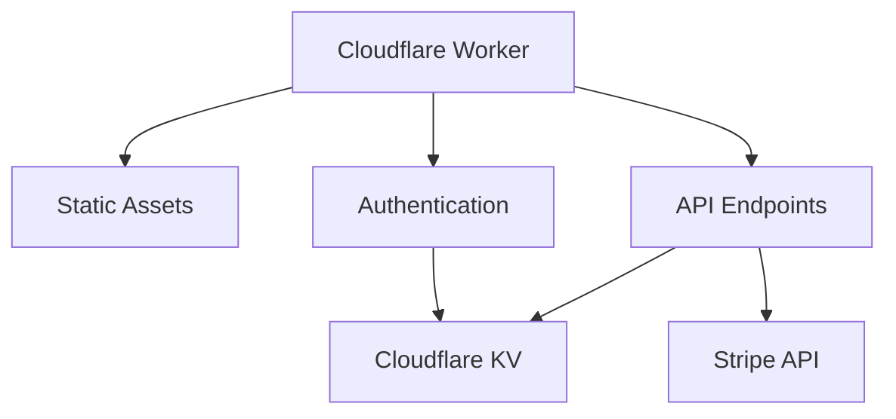
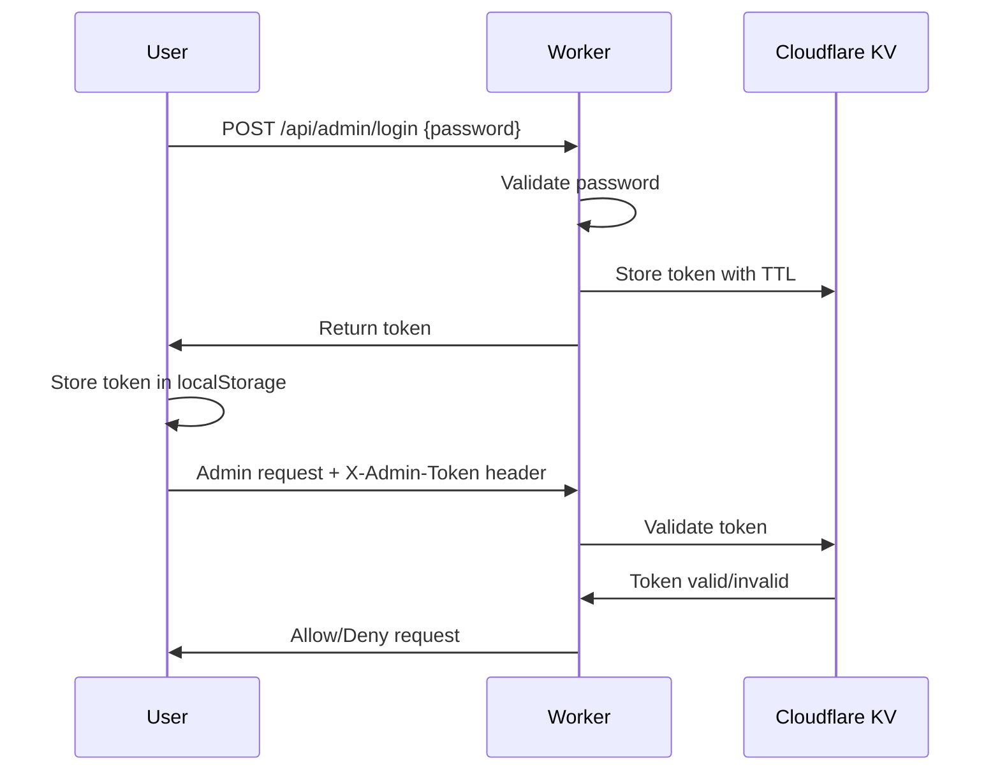

# OpenShop Architecture

## Overview

OpenShop is built entirely on the Cloudflare ecosystem, leveraging Cloudflare Workers for hosting, Cloudflare KV for data storage, and Stripe for payments. The platform is designed to stay within Cloudflare's generous free tier while providing enterprise-grade performance and security.

## Technical Architecture



| Component | Technology | Purpose |
|-----------|------------|---------|
| **Frontend** | Vite + React + Tailwind CSS | User interface and experience |
| **Backend** | Cloudflare Workers + Hono | API endpoints and business logic |
| **Database** | Cloudflare KV | Product, collection, and settings storage |
| **Payments** | Stripe API | Payment processing and checkout |
| **Authentication** | Token-based system | Secure admin access |
| **Deployment** | Wrangler CLI | Automated deployment pipeline |

## Workers Architecture

### Migration to Cloudflare Workers

We've successfully migrated from Cloudflare Pages Functions to a modern Cloudflare Workers architecture with static asset serving.

### Architecture Comparison

#### Previous: Pages Functions
```
Cloudflare Pages Project
├── Static Files (React)
├── /functions/api/* → Pages Functions
└── KV Namespace binding
```

#### New: Cloudflare Workers ✅
```
Cloudflare Worker
├── Static Assets (React) via Workers Assets
├── Hono Framework for routing
├── Integrated API endpoints
└── KV Namespace binding
```

### Workers Advantages

#### 1. Performance Benefits
- **Faster Cold Starts**: Workers have minimal cold start time
- **Better Routing**: Hono framework provides efficient routing
- **Single Runtime**: No context switching between Pages and Functions
- **Edge Optimization**: Better performance at Cloudflare edge locations

#### 2. Generous Free Tier
- **100,000 requests/day** (vs Pages Functions limits)
- **10ms CPU time per request**
- **Static asset serving included**
- **KV operations included**

#### 3. Enhanced Node.js Compatibility
- **nodejs_compat flag**: Access to more NPM packages
- **Better Stripe integration**: Full Node.js Stripe SDK support
- **Modern JavaScript**: Latest ES modules and features
- **npm ecosystem**: Broader package compatibility

#### 4. Simplified Architecture
- **Single Deployment**: One Worker handles everything
- **Unified Configuration**: Single wrangler.toml
- **Better Development**: `wrangler dev` for full-stack development
- **Easier Debugging**: Single runtime environment

### Single Worker Deployment

```
my-store.workers.dev
├── GET  /                     → React App (index.html)
├── GET  /admin               → React App (admin routes)
├── GET  /api/products        → Worker API (public)
├── POST /api/admin/products  → Worker API (authenticated)
└── GET  /assets/*           → Static files (CSS, JS, images)
```

### Hono Framework Integration

```javascript
import { Hono } from 'hono'

const app = new Hono()

// Public endpoints (read-only)
app.get('/api/products', publicHandler)

// Admin endpoints (authenticated)
app.use('/api/admin/*', authMiddleware)
app.post('/api/admin/products', adminHandler)

// Static asset serving
app.use('/*', serveStatic({ root: './' }))
```

### Modern Workers Features
- **Node.js Compatibility**: `nodejs_compat` flag enabled
- **Static Assets**: Built-in asset serving
- **ES Modules**: Modern JavaScript imports
- **Hono Framework**: Fast, lightweight routing

## Security Architecture

### Runtime Isolation

```
Browser Environment:
├── React App (JavaScript)
├── No server access
├── No environment variables
└── Sandboxed execution

Worker Environment:
├── Server-side execution
├── Environment variables (STRIPE_SECRET_KEY, ADMIN_PASSWORD)
├── KV namespace access
└── Secure runtime isolation
```

**Key Point**: The Worker runs on **Cloudflare's secure edge servers**, completely separate from the browser environment.

### Static Asset Security

```
Worker Asset Serving:
├── dist/ files served as static content
├── No server-side code exposed to browser
├── React build is client-side only
└── API endpoints are server-side only
```

**Security**: Static assets (HTML, CSS, JS) are served directly, while API logic runs server-side only.

### Authentication Flow



### Request Flow

```
Request Flow:
Browser → Worker → Auth Middleware → KV/Stripe
   ↑         ↑         ↑              ↑
Public    Server    Token Check    Protected APIs
```

**Protection Layers:**
- ✅ **Admin endpoints** require `X-Admin-Token` header
- ✅ **Token validation** against KV storage
- ✅ **24-hour expiration** with automatic cleanup
- ✅ **Public endpoints** are read-only

### Environment Variable Security

```javascript
// In Worker (Server-side only):
const stripe = new Stripe(c.env.STRIPE_SECRET_KEY) // ✅ Secure
const adminPass = c.env.ADMIN_PASSWORD            // ✅ Secure

// In Browser (Frontend):
// c.env is NOT accessible                        // ✅ Secure
```

**Critical**: Environment variables are **only available in the Worker runtime**, never exposed to the browser.

### Enhanced Security Model

```
Security Layers:
1. HTTPS Only (Cloudflare SSL)
2. CORS Protection (Hono middleware)
3. Admin Authentication (Token-based)
4. Input Validation (Server-side)
5. Environment Isolation (Worker runtime)
```

### Data Protection

| Layer | Protection Method |
|-------|------------------|
| **Transport** | HTTPS encryption (Cloudflare SSL) |
| **Storage** | KV encryption at rest and in transit |
| **Authentication** | Token-based with server-side validation |
| **Authorization** | Endpoint-level access control |
| **Input Validation** | Server-side sanitization and validation |

### Security Implementation
- **Authentication Middleware**: Centralized auth checking
- **Token Management**: Secure KV-based session storage
- **CORS Protection**: Proper cross-origin configuration
- **Input Validation**: Comprehensive request validation

### Security Risk Analysis

#### ❌ Theoretical Risks:
1. **Source Code Visibility**: Worker code is in same repo as frontend
2. **Endpoint Discovery**: API routes are discoverable
3. **Single Domain**: Frontend and backend on same domain

#### ✅ Risk Mitigations:
1. **No Secrets in Code**: All sensitive data in environment variables
2. **Authentication Required**: Admin endpoints require valid tokens
3. **Server-Side Validation**: All security checks happen server-side
4. **Cloudflare Security**: Built-in DDoS, rate limiting, WAF protection

### Security Verdict: SECURE

**Why Workers Architecture is Secure:**

1. **Runtime Separation**: Browser and Worker execute in completely different environments
2. **Environment Protection**: Secrets never exposed to client-side code
3. **Authentication Layer**: Robust token-based admin authentication
4. **Cloudflare Security**: Enterprise-grade edge protection
5. **Input Validation**: Server-side validation on all endpoints

## Data Models

### Product Schema

```json
{
  "id": "prod_1a2b3c4d5e",
  "name": "Classic Cotton T-Shirt",
  "description": "A comfortable, high-quality t-shirt made from premium cotton.",
  "price": 25.00,
  "currency": "usd",
  "images": [
    "https://example.com/image1.jpg",
    "https://example.com/image2.jpg",
    "https://example.com/image3.jpg"
  ],
  "stripePriceId": "price_AbC987zyx",
  "stripeProductId": "prod_AbC123xyz",
  "collectionId": "coll_xyz789"
}
```

### Collection Schema

```json
{
  "id": "coll_xyz789",
  "name": "Summer Collection",
  "description": "Our hottest items for the summer season.",
  "heroImage": "https://example.com/hero-banner.jpg"
}
```

### Store Settings Schema

```json
{
  "logoType": "text|image",
  "logoText": "OpenShop",
  "logoImageUrl": "https://example.com/logo.png",
  "storeName": "OpenShop",
  "storeDescription": "Your amazing online store"
}
```

## Development Experience

- **Local Development**: `wrangler dev` for full-stack development
- **Hot Reload**: Live reloading for both frontend and backend
- **Debugging**: Integrated debugging with Workers runtime
- **Testing**: Easy local testing with real Worker environment

## Conclusion

The Workers architecture provides **significant benefits** with **no security compromises**. The architecture is now more performant, cost-effective, and future-ready!

